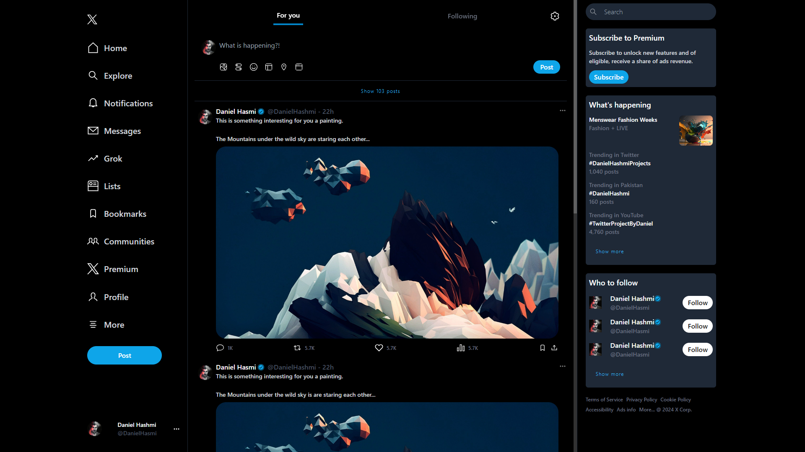

# Twitter Clone 🐦

This is a simple Twitter clone project with a focus on UI, built some functions using **JavaScript** and styled with **Tailwind CSS**.

## Features 🚀

- **UI Design**: Clean and intuitive user interface inspired by Twitter's design.
- **Responsive**: Fully responsive design ensuring compatibility across various devices.
- **Small Devices** On small devices the sidebar hides and when you swipe left & right the sidebar toggles

## Technologies Used 💻

- **JavaScript**: Used for interactivity and dynamic content.
- **Tailwind CSS**: A utility-first CSS framework used for styling.

## Demo 🎥

You can find a live demo of the application by clicking here <a href="https://twitter-clone.freewebhostmost.com/"><b>Twitter</b></a>.

## Screenshot 📷

## Contributing 🤝

Contributions are welcome! Please feel free to submit a pull request or open an issue if you encounter any bugs or have suggestions for improvements.
